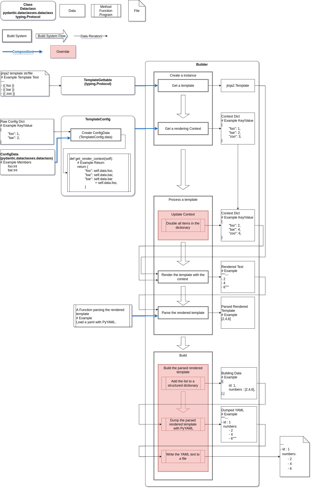

Design of Templa
================

Templa aims to separate data and build mechanisms, improving the clarity and manageability of the process.

Key points:

-  Uses composition to separate data and build mechanisms.
-  Divides the build process into template processing and build execution stages.
-  Ensures type safety with distinct types for each build process, enabling early bug detection.
-  Provides a comprehensive and flexible solution for various build scenarios.

The diagram below illustrates the basic design of Templa:

